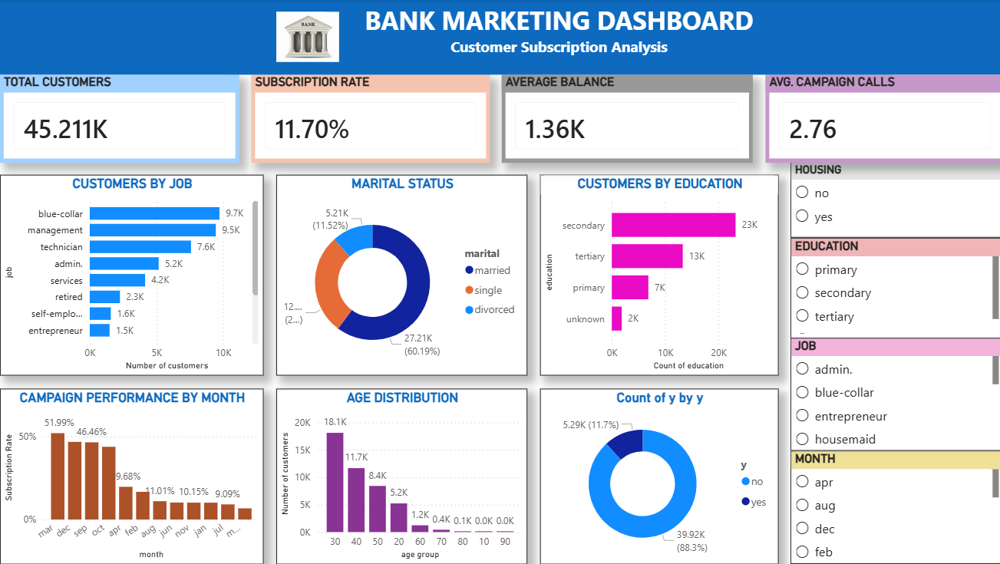

📊 Bank Marketing Analysis Dashboard

📌 Overview

This project is a Bank Marketing Analysis Dashboard created using Power BI. The dashboard helps analyze customer data and marketing campaign performance to understand customer behavior and improve decision-making. 🚀

🎯 Objective

The main objective of this project is to:

* Analyze bank customer details

* Understand subscription patterns

* Visualize marketing campaign performance

* Identify customer trends using interactive dashboards

🛠️ Tools & Technologies Used

* Power BI

* Microsoft Excel

* Data Visualization

* Data Cleaning

🗂️ Dataset Used

The dataset used for this project is the Bank Marketing Dataset from the UCI Machine Learning Repository.

* Dashboard Features

* Customer Age Analysis

* Subscription Status Analysis

* Loan Status Visualization

* Marital Status Insights

* Job Category Distribution

* Campaign Performance Charts

* Interactive Filters and Slicers

🔑 Key Insights

📌 Identified the number of customers subscribed to bank services.

📊 Compared customer subscription status based on loan categories.

👨‍💼 Analyzed customer distribution by age, job, and marital status.

🚀 Visualized overall marketing campaign performance.

